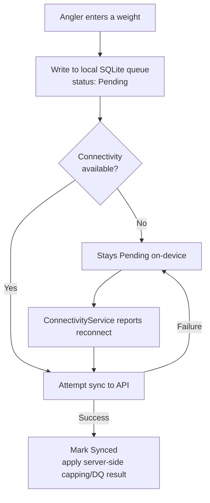

# AnglerHub Mobile

## About the Project

AnglerHub is the .NET MAUI companion app for a multi-club fishing competition
platform. Clubs run weigh-in competitions at a venue; members register, draw a
peg, get weighed in during the event, and see the results feed into a yearly
standings table. Club officers separately manage membership, venues, renewals and
payments.

The web app (a separate Laravel/PHP codebase, not part of this repository) already
covered all of this for people sitting at a computer. This app exists because the
actual point of use — weighing in the day's catch — happens standing at the
edge of a lake, often with no signal at all, holding a phone in one hand and a
keepnet in the other.
Every design decision in the weigh-in flow follows from that one constraint: it
has to work with zero connectivity and it has to be fast enough not to get in the
way.

This repository is a **curated excerpt** of a production app I built and maintain,
not the full source — see [Repository scope](#repository-scope) for exactly what's
included, what isn't, and why. It's meant to be read, not cloned and built.

---

## What the app does

- **Authentication & session handling** — token-based login, session restore on
  cold start, secure on-device storage of credentials.
- **Multi-club context** — a user can belong to several clubs; the app scopes
  everything (competitions, members, standings, permissions) to whichever club is
  currently selected, driven entirely by a `capabilities` flag the server returns
  per club rather than any client-side role logic.
- **Competitions** — browse upcoming/past competitions, view details, register,
  draw pegs (random or manual), start/close a competition.
- **Weigh-ins, fully offline-first** — the core feature of the app. Every weight
  gets written to a local SQLite queue first and synced to the server opportunistically.
- **Camera + on-device OCR ("smart reading")** — point the camera at a digital
  scale display and the app pre-fills the weight for you to confirm. Runs fully
  on-device (ML Kit / Vision), no network needed.
- **Standings** — yearly rankings per competition type, with an offline cache
  fallback when the network is unavailable.
- **Club administration** — venues, member lists, renewals, financial overview,
  outstanding payment approval for club owners/treasurers.
- **Localization** — UI available in 7 languages.

## Technologies

- C# / .NET MAUI — one codebase targeting Android, iOS, Windows and Mac Catalyst
- MVVM via CommunityToolkit.Mvvm (`[ObservableProperty]`, `[RelayCommand]`,
  partial properties)
- SQLite (`sqlite-net-async`) for on-device storage
- A typed `HttpClient` wrapping a REST API with a uniform response envelope
- `Plugin.Maui.OCR` (Google ML Kit on Android, Apple Vision on iOS) for on-device
  text recognition
- Dependency injection via `Microsoft.Extensions.DependencyInjection`
- `SecureStorage` (iOS Keychain / Android Keystore / Windows Credential Locker)
  for anything credential- or identity-shaped

The backend is a separate Laravel/PHP REST API (its own repository, not part of
this one) — the mobile app and the web app share nothing but the HTTP contract.

## Development Approach

The app was built screen by screen against an already-live API, rather than
designed top-down before the API existed — the DTOs in `Models/` are a close
mirror of the API's own response resources for exactly that reason (see
[Working with Data](#working-with-data)). Each screen follows the same shape:
a service (talking to the API and/or local storage) injected into a view model,
bound to a XAML page.

The offline-first weigh-in flow was the one piece that couldn't be bolted on
after the fact — it had to be the starting assumption for that whole part of the
app, not a fallback path added once "what if there's no signal" came up in
testing. Every other screen with a network dependency (standings, the dashboard)
later reused the same underlying idea — try the network, fall back to the last
good local snapshot — once it was clear how well that shape worked for weigh-ins
specifically.



Nothing in this flow blocks the UI — recording a weight always succeeds
immediately from the angler's point of view, and syncing is something that
happens to the app, not something the person has to wait on or retry manually.

## Architecture

**Offline-first, not offline-tolerant.** The weigh-in flow doesn't try to detect
connectivity before deciding what to do — it always writes to SQLite first, always
returns immediately to the UI, and only *afterwards* tries to sync if there happens
to be a connection. A failed sync just leaves the row `Pending`; it never surfaces
as an error to the person weighing in their catch. This shows up in a few places:

- `WeighingSyncQueue` batches everything without a photo into a single sync call,
  but sends photo entries one at a time over multipart, since a file can't ride
  along in a JSON batch.
- Every locally queued entry carries a client-generated UUID, which the API uses
  to de-duplicate — if the same weighing gets synced twice (e.g. after a retry),
  the server only processes it once.
- View models optimistically update running totals locally the moment something
  is queued, rather than waiting on a round trip, since the whole point of the
  feature is that a round trip might not happen for hours.

**Permissions come from the server, not the client.** The mobile app doesn't
re-implement any "who can do what" logic — every club exposes a `capabilities`
object and the UI just reacts to it. Keeping that logic in exactly one place (the
API) is what keeps the web app and mobile app from quietly drifting apart on who's
allowed to do what.

**View models stay UI-framework-agnostic where it matters.** Services
(`ApiClient`, `WeighingSyncQueue`, `SessionService`, ...) don't know MAUI exists;
they're plain C# classes injected via DI, which made the offline-sync logic in
particular straightforward to reason about independently of any page.

**The design system is shared, not duplicated, across web and mobile.**
[`Colors.xaml`](Resources/Styles/Colors.xaml) uses the exact same hex values as
the web dashboard's CSS (see [AnglerHub Web](https://github.com/Voorbeelden/AnglerWeb)) —
the same dark navy background, the same green accent — so the two clients read
as one product rather than two separately-designed ones. `Styles.xaml` then
turns each color into a small set of reusable, named styles (`ListRowFrame`,
`NumberBadge`, ...) rather than repeating raw hex values and stroke thicknesses
on every page.

**OCR is a suggestion, never an autofill-and-forget.** `ScaleReadingService`
deliberately narrows what it returns — a plausible weight has to be between 0 and
50kg with 1-3 decimals, anything else is treated as a failed read rather than a
guess. Even a successful read only pre-fills the weight field; the angler still
confirms it before it's queued. OCR on a photo of a 7-segment display is simply
never reliable enough to skip that confirmation step.

## Working with Data

The API returns a uniform `{ success, message, data }` envelope on every
endpoint, unwrapped once in `ApiClient.ReadAsync<T>()` rather than repeated per
call. The DTOs in `Models/DomainModels.cs` mirror the API's own response
resources field-for-field, which is what makes keeping the client and server in
sync mostly mechanical when the API contract changes — the main risk is
forgetting to update one side, not knowing how.

On-device, two SQLite-backed stores handle different jobs:

- `WeighingSyncQueue` is a write-ahead queue — every locally recorded weight
  lives here until it's confirmed synced, keyed by a client-generated UUID for
  idempotent retries.
- `OfflineDataCache` is a read-through cache — the last successful response for
  a given request (standings, upcoming competitions) is cached under a key that
  encodes the active filters, and served back if a later request fails.

Both exist for the same underlying reason (the network can't be trusted to be
there), but they grew as two separately-shaped mechanisms rather than one — see
[Future Improvements](#future-improvements) for how I'd address that now.

## Security and Privacy

The token and the signed-in user's profile are both stored via `SecureStorage`
(Keychain / Keystore / Credential Locker — encrypted at rest), not in plain
`Preferences`, since the user object carries personal data (name, email, role)
and deserves the same treatment as the token itself.

Authorization is intentionally *not* duplicated client-side: every club the
person belongs to comes with a `capabilities` object from the server, and the UI
only ever reacts to it (showing/hiding actions, enabling/disabling buttons) —
there's no local "is this user an owner" logic that could drift out of sync with
what the server actually enforces.

**About this repository specifically.** This is a real, deployed app used by
real clubs, built as freelance/contract work — not something I'm free to publish
in full. So beyond selecting which files to include:

- Identifiers that point at the live product — its real name, the production API
  domain, and the app/bundle ID — have been replaced with placeholders throughout.
- Domain terminology has been translated from the original Dutch to English for
  readability here; the production codebase uses the club's own terminology.
- The full ~50-endpoint API client, validation rules and the paid-subscription/
  Stripe integration are excluded entirely rather than sanitized in place — see
  [Repository scope](#repository-scope).

## Repository layout

```
anglerhub-mobile/
├── Services/
│   ├── WeighingSyncQueue.cs        offline-first weigh-in queue (SQLite + sync)
│   ├── ScaleReadingService.cs      camera + on-device OCR ("smart reading")
│   ├── SessionService.cs           token/user session via SecureStorage
│   └── ApiClient.excerpt.cs        REST client pattern (2 of ~50 endpoints)
├── ViewModels/
│   ├── StandingsViewModel.cs       cache-fallback loading pattern
│   └── WeighingEntryViewModel.cs   the weigh-in screen's save flow
├── Views/
│   └── StandingsPage.xaml          XAML for StandingsViewModel above
├── Resources/Styles/
│   ├── Colors.xaml                 design tokens shared with the web app
│   └── Styles.xaml                 the 6 reusable styles StandingsPage.xaml uses
├── Converters/
│   └── Converters.cs               a handful of the app's XAML value converters
├── Models/
│   └── DomainModels.cs             a representative slice of the API DTOs
└── DI/
    └── MauiProgram.excerpt.cs      service/view-model registration pattern
```

## Repository scope

This is a real, deployed app, so rather than not showing it at all, I pulled out
the pieces that best represent the interesting engineering (the offline sync
queue, the OCR integration, the caching pattern, the general shape of the
MVVM/DI setup) and left the rest out entirely:

- The full ~50-endpoint API client, the complete set of ~25 screens and view
  models, validation rules, and the paid-subscription/Stripe integration are not
  included.
- Identifiers that point at the live product have been replaced with
  placeholders throughout (see [Security and Privacy](#security-and-privacy)).

If you'd like to see more of it in an interview setting, I'm happy to walk through
the full codebase live.

## Development Responsibilities

### Mobile App Development
Design and development of the .NET MAUI application across Android, iOS, Windows
and Mac Catalyst from a single codebase, including the MVVM wiring (view models,
data binding, commands) behind every screen.

### Offline Sync Engine
Designing and building the SQLite-backed weigh-in queue: write-ahead local
storage, idempotent sync via client-generated UUIDs, batched vs. per-item sync
depending on whether a photo is attached, and automatic retry on reconnect.

### Computer Vision / OCR Integration
Integrating on-device OCR (`Plugin.Maui.OCR`) for reading a weight off a photo of
a digital scale, including the text-parsing logic that turns raw recognized text
into a plausible weight or a clean "not found" result.

### API Integration
Building the typed `HttpClient` wrapper around the backend's REST API, keeping
~50 endpoint methods and their DTOs in sync with the server's response
resources as the API contract evolved.

### UI / UX
Screen layout and interaction design in XAML, consistent with the platform's
native look on each target (Android/iOS/Windows/Mac Catalyst), including the
custom value converters needed to bind domain data to UI state.

### Localization
Structuring the app's strings for translation and shipping the UI in 7
languages.

### Analysis and Design
Translating a real, physical constraint (weighing in keepnets at the waterside with
unreliable signal) into the offline-first architecture described in
[Development Approach](#development-approach) — this shaped the weigh-in flow's
design more than any single technical requirement did.

### Testing
Manual testing across the offline/online boundary specifically — recording
weights with connectivity toggled off, reconnecting mid-session, and verifying
the sync queue drains correctly and idempotently rather than double-submitting.

## Business Functionality

An angler registers for a competition, gets a peg assigned (randomly drawn or
manually set by a club officer), and once the competition ends, each angler's
keepnet is weighed as a whole — either typed in manually or read off a photo of
the scale via OCR, always confirmed by the angler or club official before being
saved. Every recorded weight is queued locally first and synced when possible,
so the flow doesn't change whether there's signal at the venue or not. Once the
competition closes, results feed into the club's yearly standings, split by
competition type and adjustable by year. Club officers separately manage who's
eligible to fish, which venues are available, and outstanding payments — all
scoped to whichever club they're currently acting on behalf of.

The overall goal is that the person actually standing at the water's edge never
has to think about connectivity, and that permissions and business rules stay
defined in exactly one place (the server) rather than being re-derived and
potentially drifting apart on the client.

## Future Improvements

A few honest notes, since a portfolio README without any self-critique is a bit
suspicious:

- **Two separate local-storage mechanisms for a related problem.**
  `WeighingSyncQueue` (write-ahead queue) and `OfflineDataCache` (read-through
  cache) both exist because the network can't be trusted, but they grew as two
  independently-shaped pieces rather than one. I'd unify them behind a single
  local-first data layer with one consistent story for "what's on-device right
  now and how fresh is it," instead of two different answers to that question
  depending on which screen you're looking at.
- **`ApiClient` is one large class covering every endpoint.** At ~50 methods in
  one file, it works, but splitting it into smaller, resource-scoped clients
  (competitions, weighings, club administration) behind interfaces would make
  it easier to mock in tests and easier to navigate as the API keeps growing.
- **Error messages are still a mix of user-facing and developer-facing strings**
  in a few older view models from earlier in the project; newer screens are more
  disciplined about keeping those separate.
- **No automated tests.** The offline-sync logic in particular (`WeighingSyncQueue`,
  the idempotency handling) is exactly the kind of state-machine-shaped code
  that benefits from tests more than most — it's currently only verified by hand.

## What this project demonstrates

- Cross-platform mobile development with .NET MAUI, one codebase across four
  platforms
- Offline-first architecture designed around a real physical constraint, not
  bolted on afterward
- Idempotent sync design (client-generated UUIDs, batched vs. per-item sync)
- On-device computer vision integration (OCR) with deliberately conservative
  result validation
- MVVM with dependency injection, and services kept independent of the UI
  framework
- Server-driven authorization instead of client-side role logic
- Secure on-device credential storage
- Awareness of what shouldn't ship in a public repository, and why (see
  [Security and Privacy](#security-and-privacy))

## Development Summary

The app grew screen by screen against an already-live API, with the offline-first
weigh-in flow as the one piece designed up front rather than incrementally, since
it had to work from day one without connectivity. That same
try-the-network-then-fall-back-to-local shape later got reused for standings and
the dashboard once it was clear how well it worked. The result is a MAUI app
where the trickiest engineering — reliable, idempotent syncing of user-entered
data over an unreliable connection — sits behind a small, testable service layer
that the rest of the app's screens build on top of.

## License

Shared for portfolio purposes only. Not licensed for reuse, redistribution or
building a derivative app from — see [Repository scope](#repository-scope) for
what's intentionally left out.
